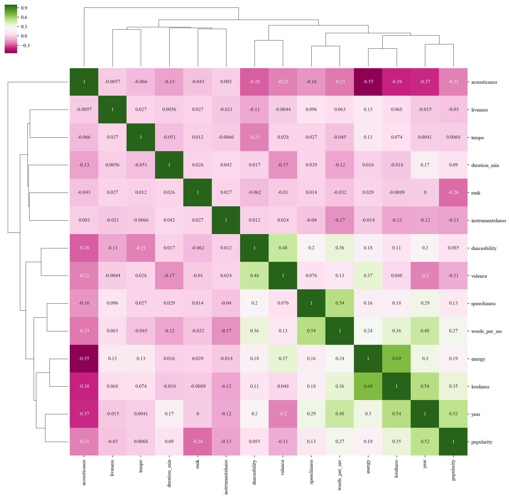

```{r setup, include=FALSE}
knitr::opts_chunk$set(echo = TRUE, warning = FALSE)
```

```{r}

library(readr)
library(tidyverse)
library(ggplot2)
library(gridExtra)
library(stringr)
library(ggthemes)
library(dplyr)
library(GGally)
library(vcd)
library(extracat)
library(DAAG)
library(forcats)
library(tibble)
library(lubridate)
library(skimr)
library(plotly)
library(parcoords)
library(RColorBrewer)
source('../scripts/global.R')
```


# Introduction
### Team
- **Manksh Gupta** (mg3835): exporatory data analysis, visualization (static plots), research, Executive summary
- **Kathy Lin** (kl2615): exploratory data analysis, visualization (static and Shiny dashboard) 
- **Louis Massera** (lm3287): exploratory data analysis, visualization (static plots and Shiny dashboard)
- **Chong Zhao** (cz2470): data processing, exploratory data analysis, visualization (static plots), writing final report

### Motivation
Popular music offers a unique lens through which to study how a culture evolves. It allows us to mine insights about what preoccupies a society, what it values in its entertainment, and how its preferences change with each generation. Because an analysis of "all mainstream music" is beyond the practical scope of this class, we limit our view to only the 100 most popular songs for each of the past 50 years.

To enable our analysis, we turn to one of the world's most popular streaming music providers, Spotify, which not only contains a comprehensive catalog of mainstream songs but also a database of proprietary data describing various auditory features of each song. In addition to these auditory features, another rich source of data is the lyrics of the songs themselves, which when combined with Spotify's audio features, paints a vivid portrait of a changing musical landscape. Specifically, we seek to explore questions relating to the following themes:

- **Artists** (most popular, longevity, most explicit, most danceable, most collaborative, etc.)
- **Audio features** (evolution over time)
- **Words** (most frequent, usage over time, relationship to audio features)


# Data description

For this analysis, we focus primarily on the US music market and use Billboard's Yearly Top 100 chart as our means of determining the most popular singles for each year. Billboard is a weekly music news magazine that publishes a weekly chart of the top 100 songs sold each week. This weekly chart is considered the industry standard for measuring the success of commercial music and serves as the basis for compiling the Yearly Top 100 chart. This yearly chart starts the first week of December to the last week in November of each year. A single gains points on the yearly chart for each weekly chart it appears on, with a weekly position of 100 yielding a single point and a position of 1 yielding 100 points ([source: billboardtop100of.com](http://billboardtop100of.com/billboard-top-100-year-end-chart/)).

### Data acquisition
Because it is not possible to obtain Billboard's chart data and corresponding song lyrics without some form of extensive web scraping, we opted instead to use a [dataset compiled by Kaylin Walker on May 8, 2016](https://github.com/walkerkq/musiclyrics) consisting of the yearly top 100 singles and their lyrics from 1965-2015. However, our primary data, Spotify's audio features, was accessed directly on February 21, 2018 by querying Spotify's API using the obtained list of top 100 singles, the Python script for which can be found [here](https://github.com/manksh/EDAV_Dream_Team/blob/master/scripts/query-spotify.py). We then merge these features back into the Billboard dataset, as detailed [here](https://github.com/manksh/EDAV_Dream_Team/blob/master/scripts/query-spotify.ipynb).

```{r}
df = read_csv('../data/billboard-spotify.csv')
colnames(df)
```

### Description of relevant features

The dataset consisting of merged Billboard and Spotify data contains a 5100 rows, one for each song, each with the following features:

- **rank**: The rank of the song in its Yearly Top 100 chart, with $1$  being the highest and $100$ being the lowest.
- **song**: The song's name.
- **artist**: The song's artist.
- **year**: The year in which the song placed in the Yearly Top 100 chart.
- **lyrics**: The lyrics for that song.
- **acousticness**: A confidence measure from 0.0 to 1.0 of whether the track is acoustic. 1.0 represents high confidence the track is acoustic.
- **danceability**: Describes how suitable a track is for dancing based on a combination of musical elements including tempo, rhythm stability, beat strength, and overall regularity. A value of 0.0 is least danceable and 1.0 is most danceable.
- **duration_ms**: Length of the song in milliseconds.
- **energy**: A measure from 0.0 to 1.0 and represents a perceptual measure of intensity and activity. Typically, energetic tracks feel fast, loud, and noisy. For example, death metal has high energy, while a Bach prelude scores low on the scale.
- **explicit**: Binary variable with $0$ indicating a non-explicit song and $1$ indicating an explicit song.
- **instrumentalness**: Predicts whether a track contains no vocals. "Ooh" and "aah" sounds are treated as instrumental in this context. Rap or spoken word tracks are "vocal". The closer the instrumentalness value is to 1.0, the greater likelihood the track contains no vocal content. Values above 0.5 are intended to represent instrumental tracks, but confidence is higher as the value approaches 1.0.
- **liveness**: Detects the presence of an audience in the recording. Higher liveness values represent an increased probability that the track was performed live. A value above 0.8 provides strong likelihood that the track is live.
- **loudness**: The overall loudness of a track in decibels (dB). Loudness values are averaged across the entire track and are useful for comparing relative loudness of tracks. Loudness is the quality of a sound that is the primary psychological correlate of physical strength (amplitude). Values typical range between -60 and 0 db.
- **mode**: Mode indicates the modality (major or minor) of a track, the type of scale from which its melodic content is derived. Major is represented by 1 and minor is 0.
- **popularity**: A measure between 0 and 1 indicating how many times that song has been streamed.
- **speechiness**: Detects the presence of spoken words in a track. The more exclusively speech-like the recording (e.g. talk show, audio book, poetry), the closer to 1.0 the attribute value. Values above 0.66 describe tracks that are probably made entirely of spoken words. Values between 0.33 and 0.66 describe tracks that may contain both music and speech, either in sections or layered, including such cases as rap music. Values below 0.33 most likely represent music and other non-speech-like tracks
- **tempo**: The overall estimated tempo of a track in beats per minute (BPM). In musical terminology, tempo is the speed or pace of a given piece and derives directly from the average beat duration.
- **time_signature**: An estimated overall time signature of a track. The time signature (meter) is a notational convention to specify how many beats are in each bar (or measure).
- **valence**: A measure from 0.0 to 1.0 describing the musical positiveness conveyed by a track. Tracks with high valence sound more positive (e.g. happy, cheerful, euphoric), while tracks with low valence sound more negative (e.g. sad, depressed, angry).

Source: [Spotify API](https://developer.spotify.com/web-api/get-audio-features/)

# Analysis of data quality

```{r}
# skimr output
spotifydf <- as.tibble(df)
skimr::skim(spotifydf)
#visna plot
visna(spotifydf, sort='b')

```

From above, we are fortunate to find no significant problems with the numerical features (i.e. values with ranges that do not make sense). However, there are 337 songs that have missing values for all Spotify features due to the fact that these songs were queried unsuccessfully. The plot below shows that the missingness of these features is mostly uncorrelated with the year in which the song charted (missing not at random).

```{r}
na_years = df %>%
    filter(is.na(acousticness)) %>%
    dplyr::select(year)
ggplot(na_years, aes(x=year)) + geom_histogram(bins=51)
```

```{r, fig.height=2, fig.width=10}
instrumentalness_df = df %>%
  filter(!is.na(instrumentalness)) %>%
  group_by(is.na(lyrics)) %>%
  summarize(avg_instrumentalness = mean(instrumentalness, rm.na=TRUE))

colnames(instrumentalness_df) = c('is_na', 'instrumentalness')

ggplot(instrumentalness_df) + geom_col(aes(x=is_na, y=instrumentalness)) + coord_flip()
```
Additionally, 250 songs have no lyrics. We suspect that this is due to the songs being instrumental. While we cannot manually check if this is the case for all 250 songs, we can, using Spotify's audio feature "instrumentalness", check the average instrumentalness of songs for which lyrics were available and songs for which they were not available. Indeed, we see that instrumentalness of songs without lyrics is much higher than those with lyrics, suggesting that at least some of the songs with missing lyrics had no lyrics to begin with.

One significant problem we noticed in the lyric text is that some lyrics were not scraped properly; for certain songs, there exists no demarcation between the final word of a line and the first word of the next line, resulting in merged words such as:

- else + in = elsein
- downtown + just = downtownjust

A cursory visual inspection shows that this problem does not apply to all lyrics, yet estimating the number of songs affected much less addressing this issue is beyond the scope of this project. Had time permitted, we would have processed the text using an NLP package to detect "out of vocabulary" words to gauge the extent of this issue.

A more tractable problem in the data is that some songs may become popular near the end of a year and remain popular through the beginning of the following year, resulting in 201 songs with a duplicate.

```{r}
nrow(df[(duplicated(df[c('artist', 'song')])),][c('artist', 'song')])
```
Duplicates are detected on the basis that an artist and song should comprise a unique pair, and duplicated artist-song pairs are removed from the dataset. Because the data is ordered chronologically, this means that the later record is always removed.

```{r}
df = df[!(duplicated(df[c('artist', 'song')])),]
```

Below, we derive 4 additional features to aid in analysis:

- **words_per_sec**: We perform a word count on the lyrics of each song and divide by the duration of the song in seconds.
- **duration_min**: To make the duration of each song more understandable, we convert from milliseconds to minutes.
- **decade**: We apply a floor function to each year divided by 10, and multiply the result by 10. Note that this is different from rounding to the nearest decade.
- **artist_base**: The artist names often contain additional information when a second artist is "featured" as part of a collaboration. We derive an "artist base" feature so we may perform analyses only on the primary artist of each song. Because the "artist" feature is all formatted similarly, this involves only removing the character sequence "feat" and all characters that follow it.

```{r}
# calculate words per second
temp = strsplit(df$lyrics, split=" ")
df['words_per_sec'] = sapply(temp, length) / (df['duration_ms'] / 1000)

# calculate duration in minutes
df['duration_min'] = df['duration_ms'] / 1000 / 60

# create a decade column
df['decade'] = floor(df['year'] / 10) * 10

# create base artist by stripping away featured artists
df = mutate(df, artist_base = str_replace_all(artist, "\\s\\(*feat.*", ""))
```

# Main analysis

We present this exploratory data analysis in four sections as outlined in the introduction: artists, words, and audio features.

### Artists
In this subsection, we examine the data at the artist level to answer some basic initial questions.

```{r, fig.width=10, fig.height=5}
top_artists = df %>%
                group_by(artist_base) %>%
                summarize(num_singles = n()) %>%
                arrange(desc(num_singles))
top_artists_30 = top_artists[0:30,]
ggplot(top_artists_30, aes(x = reorder(artist_base, num_singles), y = num_singles)) +
    geom_col() + 
    coord_flip() +
    xlab('Artist') +
    ylab('Number of yearly top 100 singles from 1965-2015') +
    labs(title = 'Who are the most popular artists of the past 50 years?')
```


```{r}
most_explicit_artists = df %>%
                group_by(artist_base) %>%
                summarize(explicitness = sum(explicit)) %>%
                arrange(desc(explicitness))

most_explicit_artists = most_explicit_artists[0:30,]
ggplot(most_explicit_artists, aes(x = reorder(artist_base, explicitness), y = explicitness)) +
    geom_col() + 
    coord_flip() +
    xlab('Artist') +
    ylab('Number of yearly top 100 explicit singles from 1965-2015') +
    labs(title = 'Who are the most popular explicit artists of the past 50 years?')
```

To measure the explicitness of each artist, we initially considered averaging the binary 0/1 explicit attribute of each song by artist. However, because many artists only have 1 single in the Yearly Top 100 throughoug their career, this results in many artists having an average explicitness of 1. Thus, we fall back to simply counting the number of explicit singles per artist. Interestingly, only the top 3 most explicit artists (Eminem, Ludacris, and Drake) are also among the top 30 most popular artists. Eminem and Ludacris are famously prolific and explicit; in fact we can see that all 15 and 14, respectively, of their top singles are explicit. More generally, we also notice that the vast majority of these singles are from the hip hop and rap genres.

```{r, fig.width=15, fig.height=5}

most_featuring_artists = df %>%
                    mutate(is_collab = str_detect(artist, 'feat')) %>%
                    group_by(artist_base) %>%
                    summarize(num_collaborations = sum(is_collab)) %>%
                    arrange(desc(num_collaborations))
most_featuring_artists = most_featuring_artists[0:20,]

p1 = ggplot(most_featuring_artists, aes(x = reorder(artist_base, num_collaborations),
                                              y = num_collaborations)) +
    geom_col() +
    xlab('Main artist') +
    ylab('Number of top 100 singles featuring a guest artist') +
    scale_y_continuous(breaks=1:9, labels=1:9) + 
    coord_flip()

matches = str_match(as.list(df['artist'])$artist, 'featuring\\s(.*)')
matches = matches[, 2]
matches = matches[!is.na(matches)]
matches = as_tibble(matches)

featured_artists = matches %>%
                    group_by(value) %>%
                    summarize(num_features = n()) %>%
                    arrange(desc(num_features))
featured_artists = featured_artists[1:20,]

p2 = ggplot(featured_artists, aes(x = reorder(value, num_features),
                                              y = num_features)) +
    geom_col() +
    xlab('Featured artist') +
    ylab('Number of top 100 singles featured as guest') +
    scale_y_continuous(breaks=1:12, labels=1:12) + 
    coord_flip()

grid.arrange(p1, p2, ncol=2)
```

Many top singles are the product of a collaboration between two artists, with the resulting artist attribution of the song taking the form "X featuring Y", where X denotes the main artist and Y denotes the guest/featured artist. Above, we see that Rihanna and Chris Brown most frequently feature other artists in their top singles, while Lil Wayne and T-Pain are the most frequent guests on other artists' top singles. Particularly interesting is the fact that while Usher, Timbaland, Santana, and David Guetta are among the 20 most "featuring" artist, they are not among even the top 20 most "featured" artists. Conversely, T-Pain, Snopp Dogg, Nicki Minah, and Will.I.Am are among the 20 most "featured" artist despite not being among the 20 most "featuring" artists.

```{r}
collaborations = df %>%
                    mutate(is_collab = str_detect(artist, 'feat')) %>%
                    group_by(year) %>%
                    summarize(num_collaborations = sum(is_collab))
ggplot(collaborations, aes(x = year, y = num_collaborations)) +
    geom_line() +
    geom_point() + 
    xlab('Year') +
    ylab('Number of top 100 singles featuring a guest artist')
```

More interesting still is the rising trend in artist collaborations over time that begins during the 1990s and takes off dramatically before plateauing in the late 2000s. Additional comments about this trend are presented in the executive summary.

```{r}
bin_width <- 1
cover <- read.csv("../data/Louis/cover_year.csv")
ggplot(cover, aes(year)) +
  geom_histogram(color = "black", fill = "lightblue", binwidth = bin_width) +
  theme(legend.position="bottom") +
  ggtitle("Cover") +
  theme(plot.title = element_text(hjust = 0.5)) +
  xlab("Year") + 
  ylab("Count")
```

The histogram above shows the number of covers each year. We define a cover as a song having the same title as a previous song in the dataset. Having removed the duplicates (artist and song comprise a unique pair now) is particularly helpful here. We can see that the number of covers increases over time, showing somehow nostalgia plays an important role in music industry. Reducing the binwidth makes that trend even clearer, we invite you to perform it on the Shiny App. All preprocessing can be found at:  [here](https://github.com/manksh/EDAV_Dream_Team/blob/master/notebooks/EDAV_project_Louis.ipynb).

```{r}
nunique_artists_year = df %>% 
                        group_by(year) %>%
                        summarize(nunique = n_distinct(artist_base))

options(repr.plot.width = 16, repr.plot.height = 6)
ggplot(nunique_artists_year, aes(x = year, y = nunique), fill='black') + 
    geom_line() + 
    geom_point() + 
    ylab('Number of unique artists')
```

The plot above shows artist diversity over time, with diversity defined not on the basis of race but on the number of unique artists with top 100 singles each year. The trend depicted shows a mixed picture; the most diverse year is in the early 1970s while the least diverse is in 2009 and 2010, yet the pattern remains noisy enough that more years are needed before making a more confident determination.

```{r, fig.width=10, fig.height=10}
top_artists = df %>%
                group_by(artist_base) %>%
                summarize(num_singles = n(), earliest_hit = min(year), latest_hit = max(year), longevity = latest_hit - earliest_hit, hits_per_year = num_singles / longevity) %>%
                arrange(desc(longevity))
top_artists_30 = top_artists[0:30,]

ggplot(top_artists_30) + geom_segment(aes(x=earliest_hit, xend=latest_hit, y=reorder(artist_base, longevity), yend=reorder(artist_base, longevity), color=num_singles), size=5) + geom_text(aes(x=latest_hit + 3, y=reorder(artist_base, longevity), label=paste(longevity, 'years'))) + ggtitle('Career spans of most timeless artists')
```

Besides just revealing which artists had the most top 100 hit singles, one of the more interesting aspects of the data is that it allows us to see which artists had the greatest longevity of career, defined simply as number of years between an artist's earliest charting hit and most recent charting hit. A caveat here is that because the latest of any duplicate singles was removed from the dataset, some artists' career lifespans appear shorter by a year than if duplicates singles had not been removed.

Above, we not only observe which artists had the greatest career longevity but also the time period during which an artist was popular, with lighter colors signifying an artist with greater numbers of total hit singles. Curiously, while Madonna and Mariah Carey have charted most frequently in the top 100, several artists, Santana, Cher, The Isley Brothers, Aretha Franklin, etc., have had longer charting careers.

This raises a natural question: does there exist a relationship between the number of singles an artist produces per year and their career span? Below, we observe that no artist has produced an average of greater than 2 hit singles a year and achieved a career span exceeding a decade. In fact, all artists generating on avearage more than 2.5 hit singles per year have career spans of less than 5 years, with the most significant "flash in the pan" artists being those that averaged 4 or more hit singles per year.

```{r}
ggplot(top_artists, aes(x = longevity, y = hits_per_year, color = num_singles)) + geom_point(alpha=0.25)
```

However, being a "flash in the pan" artist with multiple hit singles over a short span of time might still be preferable to the fates of the majority of charting artists. In the cumulative relative frequency histogram below, we see that over half of all artists are "one hit wonders", only ever generating a single hit, and over 3/4ths of artists ever generate at most 2 hits.

```{r, fig.height=3, fig.width=10}
p1 = ggplot(top_artists) + geom_histogram(aes(x=num_singles))
p2 = ggplot(top_artists) + geom_histogram(aes(x=num_singles, y=cumsum(..count../sum(..count..))))

grid.arrange(p1, p2, ncol=2)
```


### Audio features

In this subsection, we turn our focus to the audio features obtained from Spotify for each song, particularly how these features are related to one another as well as how they change over time. Originally, we aggregated each feature by year and plotted how the mean evolves over time. Not satisfied with the resulting loss in information by aggregating using solely the mean, we then incorporated additional aggregations such as the maximum and the minimum for each year before ultimately deciding to create box plots for each year to minimize information loss.

```{r}
#Duration
spotifydf <- df%>%
                group_by(year)

ggplot(spotifydf) + geom_boxplot(aes(year, duration_min, group=year))+
    ggtitle("Duration over time")+
    ylab("Duration (in Minutes)")+
    scale_x_continuous(breaks = seq(1960,2020,5))
```

From above, we observe a gradual increase in the durations of top 100 singles that peaks at 1990 with median song lengths just shy of 5 minutes before starting on a downward trend to under 4 minutes. This trend of declining song durations coincides with a decline in the variation of song lengths. One possible explanation is that as the music industry has become increasingly competitive, artists are forced to grab their audience's attention as quickly as possible, and as listeners gain access to an ever-expanding catalogue of songs, their attention spans are decreasing.

```{r}
#Acousticness
ggplot(spotifydf) + geom_boxplot(aes(year, acousticness, group=year)) +
    ggtitle("Acousticness over time") +
    ylab("Acousticness") +
    scale_x_continuous(breaks = seq(1960,2020,5))
```

Top 100 songs have been trending downward in acousticness from 1965 to 2015. This trend might also be attributed to an increasingly competitive music industry; live studio musicians and indeed recording studios themselves are much more expensive in contrast to hardware synthesizers, and later, software synthesizers on which artists can create entire songs using only a laptop computer.

```{r}
#Danceability
ggplot(spotifydf) + geom_boxplot(aes(year, danceability, group=year)) +
    ggtitle("Danceability over time")+
    ylab("Danceability ")+
    scale_x_continuous(breaks = seq(1960,2020,5))
```

While the median danceability of songs has remained relatively stable from 1985 to 2015, there exists a noticeable increase from 1965 to 1984.

```{r}
#Energy
ggplot(spotifydf) + geom_boxplot(aes(year, energy, group=year)) +
    ggtitle("Energy over time")+
    ylab("Energy ")+
    scale_x_continuous(breaks = seq(1960,2020,5))
```

Overall, there appears that songs are becoming more energetic and busier over time, though the signal is quite noisy. Most interestingly, from 1985 onwards, the change in median energy over time appears to even be cyclical.

```{r}
#Instrumentalness
ggplot(spotifydf) + geom_boxplot(aes(year, instrumentalness, group=year)) +
    ggtitle("Instrumentalness over time")+
    ylab("Instrumentalness ")+
    scale_x_continuous(breaks = seq(1960,2020,5))
```

Unsurprisingly, the median instrumentalness of top 100 singles consistently stays at or near 0, however we can observe a noticeable thinning out of outliers, suggesting that instrumental music is becoming increasingly unpopular. Additionally, this decline in the instrumentalness of songs could be tied to the decline of song lengths; if songs are becoming shorter because of declining listener attention spans, then one is likely to also observe songs with increasingly shorter instrumental introductions and interludes as artists favor "getting to the point."

```{r}
#Liveness
ggplot(spotifydf) + geom_boxplot(aes(year, liveness, group=year)) +
    ggtitle("Liveness over time")+
    ylab("Liveness ")+
    scale_x_continuous(breaks = seq(1960,2020,5))
```

There are no discernable trends in how the distribution of songs' liveness changes over time.

```{r}
#Loudness
ggplot(spotifydf) + geom_boxplot(aes(year, loudness, group=year)) +
    ggtitle("Loudness over Time")+
    ylab("Loudness ")+
    scale_x_continuous(breaks = seq(1960,2020,5))
```

Top 100 singles are unquestionably becoming much louder. We expand on an explanation of the "Loudness Wars" in the executive summary.

```{r}
#Speechiness
ggplot(spotifydf) + geom_boxplot(aes(year, speechiness, group=year)) +
    ggtitle("Speechiness over Time")+
    ylab("Speechiness ")+
    scale_x_continuous(breaks = seq(1960,2020,5))
```

Also pronounced is a dramatic increase in speechiness starting from 1990 and peaking in 2004 which may correspond with the increased popularity of rap over that period of time.

```{r}
#Tempo
ggplot(spotifydf) + geom_boxplot(aes(year, tempo, group=year)) +
    ggtitle("Tempo over Time")+
    ylab("Tempo ")+
    scale_x_continuous(breaks = seq(1960,2020,5))
```

There are no discernable trends in how the distribution of songs' tempos changes over time.

```{r}
#Valence
ggplot(spotifydf) + geom_boxplot(aes(year, valence, group=year)) +
    ggtitle("Valence over Time")+
    ylab("Valence")+
    scale_x_continuous(breaks = seq(1960,2020,5))
```

There is a general trend of songs becoming increasingly less positive, perhaps reflecting the increase in cultural and economic pressure society has been experiencing.

```{r}
#Verbosity
ggplot(spotifydf) + geom_boxplot(aes(year, words_per_sec, group=year)) +
    ggtitle("Verbosity over Time")+
    ylab("Words per second")+
    scale_x_continuous(breaks = seq(1960,2020,5))
```

Corresponding to the trends involving speechiness over time, we see that the number of words heard per second in songs has increased over time. Indeed, one should expect this given the previously observed speechiness trends as it is much easier to speak quickly than to sing quickly.

```{r}
keepcols <- c('year', 'acousticness', 'danceability', 'duration', 'energy', 'instrumentalness', 'liveness','loudness','speechiness', 'tempo', 'valence')

spotifydf<-spotifydf%>%
    filter(!is.na(duration_ms))%>%
    mutate(duration=duration_ms/1000/60)

spotifydf_s <- spotifydf%>%
                dplyr::select(keepcols) %>%
                group_by(year)%>%
                summarize(mean_acousticness = mean(acousticness),
                        mean_danceability = mean(danceability),
                        mean_duration = mean(duration),
                        mean_energy = mean(energy),
                        mean_instrumentalness = mean(instrumentalness),
                        mean_liveness = mean(liveness),
                        mean_loudness = mean(loudness),
                        mean_speechiness = mean(speechiness),
                        mean_tempo = mean(tempo),
                        mean_valence = mean(valence)
                )
# %>%
#                 gather(key='variable', value = 'Freq', -year)
spotifydf_s$year<- factor(spotifydf_s$year, levels = unique(spotifydf_s$year))

ggparcoord(spotifydf_s, columns = 2:11, alphaLines = 0.7, groupColumn ='year',scale = 'uniminmax')+xlab("")+ylab("") + theme(axis.text.x = element_text(angle=90))
```

The parallel coordinates plot above was generated by creating an audio feature profile for each year in which we simply average each audio feature across all songs for each year. In other words, each line represents the average Spotify audio features for that year. We considered using a perceptually uniform color space to denote years, however we found that distinguishing the inner decades under such a scheme to be more difficult, so we stayed with the default. The features have also been re-scaled so that the maximum feature value is 1 and minimum is 0. Some notable observations:
- Songs from 1966 to 1975 are markedly more acoustic and less danceable than those from later years, which also display a trend of decreasing acousticness over time.
- Songs from the 1990s seem to have had the longest duration
- Songs from the most recent decade appear to be among the highest energy, least instrumental, and loudest
- Songs from the 1980s appear to be much less speechy than from other decades

To examine the correlation structure of the data's continuous features, we create a correlation matrix and visualize it with a heatmap below. Additionally, we arrange the features so that those with the most similar correlations to other features are placed near each other, with the dendrograms on the top and left showing which features are most similar to each other.

```{r}
columns = c('rank', 'year', 'acousticness', 'danceability', 'duration_min', 
            'energy', 'instrumentalness', 'liveness', 'loudness', 'popularity',
            'speechiness', 'tempo', 'valence', 'words_per_sec')

df_cor = df[columns]
correlation = cor(df_cor, method='pearson', use='pairwise.complete.obs')

col = colorRampPalette(c('red', 'white', 'green'))(20)
heatmap(x = correlation, col = col, symm = TRUE)
```

**Note**: This heatmap below was originally created in Python using the Seaborn visualization library. In translating the visualization to R using R's heatmap functionality, we were unable to produce a legend nor annotate the grid cells individually. We present this second, more ideal heatmap as an image in addition to the one created in R above.



The dendrogrammed correlation heatmap reveals some interesting aspects of the data's correlation structure:

- Popularity and year are weakly correlated. This makes intuitive sense given that the audience on Spotify are more likely to listen to more current music and that people who would enjoy the older music might be less likely to listen to it on Spotify.
- Loudness and year are also weakly correlated, as previously observed.
- Loudness and energy are moderately correlated.
- Acousticness and energy are weakly anticorrelated. This could be explained by the fact that ballads and other slow music are more likely to feature acoustic instruments.
- Valance and danceability are weakly correlated. This could suggest that for the most part, people are less inclined to dance to sad or angry music.
- Words per second is weakly correlated with speechiness. Indeed, it is easier to talk fast than to sing fast.

The correlation heatmap provides guidance as to which pairs of features are worth investigating further.

```{r, fig.width=10, fig.height=5}
p1 = ggplot(df, aes(x=acousticness, y=energy)) +
    geom_point(alpha=0.15) +
    facet_wrap(~ decade)

p2 = ggplot(df, aes(x=acousticness, y=energy, color=year)) +
    geom_point(alpha=0.5) +
    ggtitle('Acousticness vs. energy')

grid.arrange(p1, p2, ncol = 2)
```

It appears that most songs have very low acousticness (below 0.125) and high energy (above 0.5). However, outside this dense region, as a song increases in acousticness, its energy appears to decrease quadratically. Furthermore, it appears that these less common high-acoustic/lower-energy songs are predominantly older, with the vast majority of more recent songs occupying the low-acoustic/higher-energy region. We can observe this more clearly by faceting on decade. The facetted scatterplots confirm more clearly that indeed songs are trending towards lower acousticness and higher energy with each passing decade (which was also observed in the time series box plots). It should be noted that because the time range of the dataset is from 1965-2015, the facets for the 1960s and 2010s have half as many data points as the facets for other decades.

```{r, fig.width=10, fig.height=5}
p2 = ggplot(df, aes(x=danceability, y=valence, color=year)) +
    geom_point(alpha=0.5) + 
    ggtitle('Danceability vs valence')

p1 = ggplot(df, aes(x=danceability, y=valence)) +
    geom_point(alpha=0.15) +
    facet_wrap(~ decade)

grid.arrange(p1, p2, ncol = 2)
```

```{r, fig.width=10, fig.height=5}
p2 = ggplot(df, aes(x=speechiness, y=words_per_sec, color=year)) +
    geom_point(alpha=0.5) +
    ggtitle('Speechiness vs verbosity')

p1 = ggplot(df, aes(x=speechiness, y=words_per_sec)) +
    geom_point(alpha=0.15) +
    facet_wrap(~ decade)

grid.arrange(p1, p2, ncol = 2)
```

Above, we observe that speechiness and verbosity (words per second) are indeed positively correlated, albeit moderately and that top 100 singles have become increasingly more speechy and verbose starting from the 1990s when rap and hip hop first gained mainstream appeal.

```{r, fig.width=10, fig.height=5}
p1 = ggplot(df, aes(x=energy, y=loudness, color=year)) +
    geom_point(alpha=0.5) +
    ggtitle('Energy vs. loudness')

p2 = ggplot(df, aes(x=energy, y=loudness)) +
    geom_point(alpha=0.15) +
    facet_wrap(~ decade)

grid.arrange(p2, p1, ncol = 2)
```

### Words

In this subsection, we perform analyses on the words within the lyrics of each song. In particular, given the rich set of features provided by Spotify, we can explore interesting questions such as "what are the most danceable words?" To facilitate such analysis, we [use Python](https://github.com/manksh/EDAV_Dream_Team/blob/master/notebooks/create-tidy-lyrics.ipynb) to tidy our dataset at the word-level. Whereas the original song-level dataset contains one row per song, the word-level dataset contains **one row per unique word per song**. For example, if the word "dance" appears multiple times in a single song, it would be transformed into a single row in the new dataset, but if the word "dance" appears in X songs, it would be transformed into X rows in the dataset. Each row of the word-level dataset inherits all the features of the song it belongs to (year, title, artist, audio features) and contains a new feature "count" indicating the number of times the word appears in that song. Furthermore, only words that appear in at least 10 different songs are included in the new dataset. Otherwise, if we attempt to answer "what are the most danceable words" by averaging the danceability of songs that word appears in, words that appear only in the single most danceable song would dominate such a ranking.

We performed an n-gram analysis of the tidy dataset. Thanks to scikit-learn package (python), we collected the top 100 per count unigrams, bigrams and trigrams per decade (1960s to 2010s). Preprocessing can be found at [here](https://github.com/manksh/EDAV_Dream_Team/blob/master/notebooks/EDAV_project_Louis.ipynb).
To visualize them, it appeared that building word clouds was the most effective way. We will focus on some of them in the executive summary. 
Let's start with all our n-gram (unigram, bigram, trigram) by decade. We present some thoughts at the end of each plot, but encourage the reader to make their own assessments initially. We tried to add titles to each plot indicating which decade each wordcloud is visualizing, but the wordcloud package makes it quite cumbersome, unfortunately, and we were not able to accomplish this. Each sequence of wordclouds is arranged in chronological order by decade.

We begin first with wordclouds for unigrams, bigrams, and trigrams combined, arranged by decade starting from 1960s and concluding in 2010s.

```{r fig.height=6, fig.width=6}
n_gram <- read.csv("../data/Louis/n_gram.csv")
pal <- brewer.pal(9, "OrRd")
pal <- pal[-(1:3)]
for (i in 0:5){
n_gram_i <- filter(n_gram, n_gram$decade == 1960+10*i)
wordcloud(n_gram_i$word, n_gram_i$count, min.freq =3, scale=c(5, .2), random.order = FALSE, random.color = FALSE, colors= pal)}
```

Most dominant n-grams are related to feelings, self-expression and rhythm ('oh oh', 'oh oh oh'). The wordcloud does not seem to evolve that much with time, except for 'love' and 'like'. We will focus on that in the executive summary. Unigrams are dominant in those clouds, which was expected. 
Let's focus on them for each decade:

```{r fig.height=6, fig.width=6}
for (i in 0:5){
n_gram_i <- filter(n_gram, n_gram$decade == 1960+10*i, n_gram$gram == 'unigram')
wordcloud(n_gram_i$word, n_gram_i$count, min.freq =3, scale=c(5, .2), random.order = FALSE, random.color = FALSE, colors= pal)}
```

Let's have a look on bigrams only:

```{r fig.height=6, fig.width=6}
for (i in 0:5){
n_gram_i <- filter(n_gram, n_gram$decade == 1960+10*i, n_gram$gram == 'bigram')
wordcloud(n_gram_i$word, n_gram_i$count, min.freq =3, scale=c(5, .2), random.order = FALSE, random.color = FALSE, colors= pal)}
```

Finally trigrams:

```{r fig.height=6, fig.width=6}
for (i in 0:5){
n_gram_i <- filter(n_gram, n_gram$decade == 1960+10*i, n_gram$gram == 'trigram')
wordcloud(n_gram_i$word, n_gram_i$count, min.freq =3, scale=c(5, .2), random.order = FALSE, random.color = FALSE, colors= pal)}
```

We can see that both most dominant bigrams are trigrams are repetition of the same word, which is usually effective in a song. Over time, we notice that the set of most dominant bigrams and trigrams is getting poorer, putting more and more emphasis on a few of them. Should we see there a delibarate choice from artists that focus on words that were effective in previous billboard songs? Trying to find the magic words to success.

Another aspect of world analysis is the evolution of a word count in the billboard over years. Our interest is dual: to observe if there is any correlation between word counts and society events. On the other hand, to determine if these trends could be useful to decrypt people's attitude evolution over time. Let's look at 4 pair of words: ('love', 'like'), ('girl', 'boy'), ('woman', 'man'),  ('war', 'peace'). Additional analysis will be performed in the executive summary. All preprocessing can be found at:  [here](https://github.com/manksh/EDAV_Dream_Team/blob/master/notebooks/EDAV_project_Louis.ipynb).

```{r}
word_set <- list(list('love', 'like'), list('girl', 'boy'), list('woman', 'man'), list('war', 'peace'))
word_count <- read.csv("../data/Louis/word_count_per_year.csv")
for (i in 1:4){
  word1 <- word_set[[i]][[1]]
  word2 <- word_set[[i]][[2]]
  word_filter = filter(word_count, word_count$word == word1 | word_count$word == word2)
  print(ggplot(word_filter, aes(x = year, y = count, col = word)) +
  geom_line() +
  theme(legend.position="bottom") +
  ggtitle(paste(word1,word2, sep="/")) +
  theme(plot.title = element_text(hjust = 0.5)) +
  xlab("Year") + 
  ylab("Count"))
}
```

We will focus on love/like in the executive summary. 
By looking at both girl/boy and woman/man graphs, we can remark that, while girl is more used than boy, woman is less used than man. One may see the result of gender stereotypes in society, leaking in songs by infantilizing woman in the lyrics.
By looking at war/peace graph, we notice some peaks in the use of war corresponding to US military intervention accross the globe.
On the Shiny App, feel free to play around with words and compare their evolution.

Working on a word level dataset allowed us to perform audio feature analysis. We focused on energy, danceability and explicitness of words. Results are presented in wordclouds, some of them might be suprising.

```{r, }
word_df <- read.csv("../data/tidy-words.csv")
```
```{r fig.width=6, figh.height=6}
most_energetic_words = word_df %>%
                group_by(word) %>%
                summarize(energy_med = median(energy)) %>%
                filter(!is.na(energy_med)) %>%
                top_n(100, energy_med) %>%
                mutate(energy_scale = (energy_med - min(energy_med))*100/max(energy_med))

wordcloud(most_energetic_words$word, most_energetic_words$energy_scale, scale=c(2, .2), random.order = FALSE, random.color = FALSE, colors= pal)
```

```{r fig.width=6, figh.height=6}
most_danceable_words = word_df %>%
                group_by(word) %>%
                summarize(danceability_med = median(danceability)) %>%
                filter(!is.na(danceability_med)) %>%
                top_n(100, danceability_med) %>%
                mutate(danceability_scale = (danceability_med - min(danceability_med))*100/max(danceability_med))

wordcloud(most_danceable_words$word, most_danceable_words$danceability_scale, scale=c(2, .2), random.order = FALSE, random.color = FALSE, colors= pal)
```
```{r fig.width=6, figh.height=6}
most_explicit_words = word_df %>%
                group_by(word) %>%
                summarize(explicit_mean = mean(explicit)) %>%
                filter(!is.na(explicit_mean)) %>%
                top_n(100, explicit_mean) %>%
                mutate(explicit_scale = (explicit_mean - min(explicit_mean))*100/max(explicit_mean))
wordcloud(most_explicit_words$word, most_explicit_words$explicit_scale, scale=c(2, .2), random.order = FALSE, random.color = FALSE, colors= pal)

```

The most unexpected results revolved around the most explicit words; we did not expect to see "Louis Vuitton", "blunt(s)", or "squad" in the most explicit words. While these words may not be intrinsically explicit, because they appear often in songs that are explicit, they co-occur frequently with explicit words. Also of note is that many of the most danceable words, namely "titties" and "naughty" seem like they could also co-occur frequently with explicit words, suggesting an avenue for future analysis: the overlap between danceability and explicitness. 

# Executive Summary

This section of the report describes our most interesting findings and conveys those to the reader in a succinct manner. 

Popular music offers a unique lens through which to study how a culture evolves. It shows us how we as a society think and it is one form of art that everyone as a comminity enjoys. It allows us to mine insights about what preoccupies a society, what it values in its entertainment, and how its preferences change with each generation. We limit our view to only the 100 most popular songs for each of the past 50 years as we feel that is something that defines what people listened to/ liked most that year.

Our most interesting findings are logged below:

### Love conquers all, but unfortunately it’s not forever.

The analysis of the top 100 song lyrics from 1965 to 2015 reveal some interesting insghts. The most common word to appear each year is initially "love", however it’s interesting to see the most common word changes to like in subsequent years. Google word trends also confirms this fearful observation; according to Google, the popularity of the word "like" overtook the popularity of "love" at almost the same time shown in our plots. We claim that this is because of the word like developing as a filler in many of the sentences and our daily lives and has thus become a ubiquitous word in speech and song alike. However, worry not; in our hearts, love still trumps like.

```{r fig.height=6, fig.width=6}
for (i in list(0,5)){
n_gram_i <- filter(n_gram, n_gram$decade == 1960+10*i, n_gram$gram == 'unigram')
wordcloud(n_gram_i$word, n_gram_i$count, min.freq =3, scale=c(5, .2), random.order = FALSE, random.color = FALSE, colors= pal)}
```
```{r}
  word1 <- 'love'
  word2 <- 'like'
  word_filter = filter(word_count, word_count$word == word1 | word_count$word == word2)
  ggplot(word_filter, aes(x = year, y = count, col = word)) +
    geom_line() +
    theme(legend.position="bottom") +
    ggtitle(paste(word1,word2, sep="/")) +
    theme(plot.title = element_text(hjust = 0.5)) +
    xlab("Year") + 
    ylab("Count")
```

### Flash in the pan vs. steady burn

One of the more interesting aspects of the data is that it allows us to see which artists had the greatest longevity of career, defined simply as number of years between an artist’s earliest charting hit and most recent charting hit. A caveat here is that because the latest of any duplicate singles was removed from the dataset, some artists’ career lifespans appear shorter by a year than if duplicates singles had not been removed. We not only observe which artists had the greatest career longevity but also the time period during which an artist was popular, with lighter colors signifying an artist with greater numbers of total hit singles. Curiously, while Madonna and Mariah Carey have charted most frequently in the top 100, several artists, Santana, Cher, The Isley Brothers, Aretha Franklin, etc., have had longer charting careers.

```{r, fig.width=10, fig.height=8}
top_artists = df %>%
                group_by(artist_base) %>%
                summarize(num_singles = n(), earliest_hit = min(year), latest_hit = max(year), longevity = latest_hit - earliest_hit, hits_per_year = num_singles / longevity) %>%
                arrange(desc(longevity))
top_artists_30 = top_artists[0:30,]

ggplot(top_artists_30) + geom_segment(aes(x=earliest_hit, xend=latest_hit, y=reorder(artist_base, longevity), yend=reorder(artist_base, longevity), color=num_singles), size=5) + geom_text(aes(x=latest_hit + 3, y=reorder(artist_base, longevity), label=paste(longevity, 'years'))) + ggtitle('Career spans of most timeless artists') + xlab('Year') + ylab('Name of Artist')
```

This raises a natural question: does there exist a relationship between the number of singles an artist produces per year and their career span? In the left plot below, we observe that no artist has produced an average of greater than 2 hit singles a year and achieved a career span exceeding a decade. In fact, all artists generating on avearage more than 2.5 hit singles per year have career spans of less than 5 years, with the most significant “flash in the pan” artists being those that averaged 4 or more hit singles per year.

```{r, fig.width=10, fig.height=3}
p1 = ggplot(top_artists, aes(x = longevity, y = hits_per_year, color = num_singles)) + geom_point(alpha=0.25) +ylab('Hits Per Year')
p2 = ggplot(top_artists) + geom_histogram(aes(x=num_singles, y=cumsum(..count../sum(..count..))), bins=31) + ylab('Cumulative Density')

grid.arrange(p1, p2, ncol=2)
```

However, being a "flash in the pan" artist with multiple hit singles over a short span of time might still be preferable to the fates of the majority of charting artists. In the cumulative relative frequency histogram above and right, each bar indicates the proportion of artists with at most **x** hit singles over their entire career. In other words, the leftmost bar shows the proportion of artists with at most one hit single, the next bar the proportion of artists with at most two hit singles, etc. We see that over half of all artists are "one hit wonders", only ever generating a single hit, and over 3/4ths of artists ever generate at most 2 hits.

### Pay attention to me!

The music market has become increasingly competitive with artists trying to vie for the attention of users from all age groups. The rise of streaming services such as Spotify and Apple music has made music easily accessible, but also, has exposed people to more types of music genres and thus, it has become harder to capture and keep the attention of listeners 


```{r, fig.width=10, fig.height=5}

p1 = ggplot(df, aes(x=energy, y=loudness, color=year)) +
    geom_point(alpha=0.5) +
    ggtitle('Energy vs. loudness') +xlab('Energy')

p2 = ggplot(df, aes(x=energy, y=loudness)) +
    geom_point(alpha=0.15) +
    facet_wrap(~ decade) 

grid.arrange(p2, p1, ncol = 2)
```

Above, we plot the energy and loudness of every single song; on the left, the 6 scatter plots are filtered by decade (i.e. only songs from that decade are plotted), and on the right, we plot all songs together with the year in which it charted shown as a color. In both cases, we observe that both the energy and loudness of songs has been increasing over time, particularly after the 1990s.

This relates directly to a phenomenon known as the "Loudness Wars", which "refers to the trend of increasing audio levels in recorded music." [Wikipedia](wikipedia.org/wiki/Loudness_war#1980s) 

With the advent of the Compact Disc (CD), music is encoded to a digital format with a clearly defined maximum peak amplitude. Once the maximum amplitude of a CD is reached, loudness can be increased still further through signal processing techniques such as dynamic range compression and equalization. It has been observed and documented that since the 1990’s, artists have adopted the practice of making their songs louder in the hopes of more successfully catching listeners' attention on the radio. However, this naturally sets off a chain reaction where all artists must follow the same practice lest their songs sound "weaker" by comparison.


```{r, fig.width=10, fig.height=5}
p1 = ggplot(df, aes(x=instrumentalness, y=duration_min, color=year)) +
    geom_point(alpha=0.5) +ylab('Duration(mins)')

p2 = ggplot(df, aes(x=instrumentalness, y=duration_min)) +
    geom_point(alpha=0.15) +
    facet_wrap(~ decade) +ylab('Duration(mins)')

grid.arrange(p2, p1, ncol = 2)
```

Other trends in the data can also be attributed to an increasingly competitive environment for artists. Above, we plot the instrumentalness of each song against its duration in minutes and observe that both the instrumentalness and duration of songs has been declining since the 1970s.

That song durations are becoming less variable is strongly related to our earlier hypothesis about the increasing need and difficulty of capturing audience's attention in a world where more music than ever is available at the press of a button.

The National Endowment for the Arts reported that in 2012, only 8.8% of Americans had attended a classical music performance in the previous 12 months, compared to 11.6% a decade earlier.

Classical music is by construct not very loud in the sense loudness is defined and thus it doesnt catch the modern youths' ear. Also, the shorter attention span of the modern youth tranlsates to shorter songs meaning less time for instrumental intros or mid-song interludes

With a stifling atmosphere of rules and "appropriateness" in classical music concerts,  it gave the youth another reason to be uninterested in the whole idea of classical music. Somehow, classical music has become inaccessible and unwelcoming. There is also a  comprehensive [CNN article](https://www.cnn.com/2016/05/29/opinions/classical-music-dying-and-being-reborn-opinion-albright/index.html) that gives a deeper dive into the topic.

### Bleep Bleepin' Bleep

Our data shows a significant increase in the 'speechiness' of songs over time. Speechiness is defined as the number of words in a sing divided by the length of the songs. Typically, songs that have less 'instrumentalness' and more words tend to be more speechy. This is most popular in the Rap and Hip-Hop genre of music. 

This shows how we have changed culturally as a society; things that were once not accepted as a society and now open and Rap music is an example of that. We have culturally evolved from a more orthodox to a more open minded society. 

This is also elucidated by the fact that a popular Rap artist - Kendrick Lamar, just won the [pulitzer prize](https://www.economist.com/blogs/prospero/2018/04/damn) for music. This is the first time in history that a classic or a jazz musician has not won this piize since it was first announced. 

Rap music also tends to be loud and thus, that may be a secondry reason for its increasing popularity. We see that both loudness and speechiness have gained popularity, however, we do not have enough evidence to posit which one has caused what, its simply a correlation.

This neat [wikipedia article](https://en.wikipedia.org/wiki/Rapping#Golden_age) talks about the rise of Rap music since the 1990's and how it has become a bigger part of our daily lives. 


```{r, fig.width=10, fig.height=5}
#Speechiness
ggplot(spotifydf) + geom_boxplot(aes(year, speechiness, group=year)) +
    ggtitle("Speechiness over Time")+
    ylab("Speechiness ")+
    scale_x_continuous(breaks = seq(1960,2020,5))

ggplot(df, aes(x=words_per_sec, y=speechiness)) +
    geom_point(alpha=0.15) +
    facet_wrap(~ decade)

```

There has also been a rise in another feature in music, this may be in part related to the increasing popularity of Rap music as well. 'Explicit' words commonly form a part of the Rap music genre and we have seen a stark rise in explicit songs in the top 100 as well.

```{r, }
explicit = df %>% 
           group_by(year) %>%
           summarize(prop_explicit = sum(explicit, na.rm=TRUE))

ggplot(explicit, aes(x = year, y = prop_explicit), fill='black') + 
    geom_line() + 
    geom_point() + 
    ylab('Number of explicit songs')
```

Below is an example of the types of words we have observed in the Explicit songs over the years!

```{r fig.width=6, fig.height=6}
wordcloud(most_explicit_words$word, most_explicit_words$explicit_scale, scale=c(2, .2), random.order = FALSE, random.color = FALSE, colors= pal)
```


### Odds and ends

Here are some more interesting observations about what the commonly used words in the music industry are. It's just nice to see what words are being used commonly and to think about if we actually notice them in our daily lives while listening to music!

```{r fig.width=6, fig.height=6}
wordcloud(most_danceable_words$word, most_danceable_words$danceability_scale, scale=c(1.5, .2), random.order = FALSE, random.color = FALSE, colors= pal)
wordcloud(most_energetic_words$word, most_energetic_words$energy_scale, scale=c(1.5, .2), random.order = FALSE, random.color = FALSE, colors= pal)
```


### Interactivity

For the interactive portion of this analysis, we decided to build a RShiny Dashboard, which is linked here: https://kathyl.shinyapps.io/EDAV_SP18_DreamTeam_FinalProject/

The dashboard has a main menu with four components reflecting on the main topics of our analyses: Artists, Word Clouds, Songs, and Evolution over Time. To hide/minimize this main menu bar, you can click the icon of three bars that's next to DreamTeam Final. We recommend viewing this dashboard in a maximized web browser, and minimizing the main menu bar when viewing contents of each component individually. 

The Artists tab shows three interesting findings regarding Billboard Top 100 Artists: an artist's lifespan (which we've defined earlier as when they first appeared on the top 100 to when they last appeared), artists who have collaborated the most in their songs / artists who have been the featured artists in songs, and lastly the overall level of collaboration over time. You can view the last graph by clicking on the check box as shown in the side panel. 

The Word Clouds analysis is included as the second item on the main menu panel. As described earlier, we've analyzed the lyrics of the Billboard Top 100 songs from 1965-2015 and found interesting trends with popular words throughout the years. The user has a choice of ngrams, unigrams, bigrams, or trigrams as well as any of the decades in our dataset. It should be noted that the user may have to wait a bit before the word clouds load initially.

The next panel contains our analysis of songs which include word count over time, and number of covers in the Top 100 over time. The user can compare any two words of their choosing from the drop down menu on the sidepanel that they like and observe the behavior over time. The number of covers over time graph is controlled by the slider in the side panel which controls the binwidth of the histogram shown.

Evolution over Time is our last tab. Our dataset contained several variables (defined earlier in our report). And we decided it would be interesting to view the evolution of these variables both individually and grouped over time. The first graph shown is a univariate analysis of each variable. The user can zoom in by highlighting any time period they're interested in. To zoom out, double click. We also included a higher level interactive parallel coordinates plot that will appear once the user clicks the checkbox to allow viewing overall trends and behaviors in groups of variables.

We hope users find this interactive dashboard both engaging and informative!

### Conclusion

This brings us to the end of the project. However, we would like to take some time to reflect on the project and what we learned through the process and how we would have performed some processes differently.

The exploration and visualization process yielded a lot of surprising findings that we didn't expect. We started with a hypothesis that music reflects changes in our society and thus can be a good proxy to see how people's music preferences have evolved over time. 

Looking at the most popular words appearing in songs, we found that 'like' has replaced 'love' as the most popular word in songs starting from the 2000's. Perhaps an indication of how the meanings of these words have changed in time.

We also observed other very interesting evolutions, starting from looking at how 'loudness' of music has become an integral part of music popularity due to the decreasing attention spans of people. We also saw the cultural chanmges in society from looking at the increasing popularity of Rap music and how explicit songs have found a way into our daily lives. 

We encountered several problems; the first major problem with the data was fused words. Fused words was the situation when there exists no demarcation between the final word of a line and the first word of the next line, resulting in fused words. Word clouds have formed an important part of the project and messy word data was one of the biggest problems we had. If we had more time would have liked to use an NLP package to tag out of vocabulary words to estimate the extent of the issue. We currently removed these words from the data.

Second, we would have liked to do some more feature engineering on the features and  infer some subtle features from the data using the features we already have and see how these implicit features have changed. For instance, using the tidy words transformation and averaging the audio features by word is a very heuristic method of calculating features like "danceability" for each word. A better method would have been to convert each song's lyrics to bag-of-words data and trained multiple linear regressions using the lyrics to predict the song's audio feature (i.e. one regression model for danceability, one regression model for energy, etc.). We could then use the coefficients from the linear regression to tell us what the most and least danceable/energetic/loud/acoustic/etc. Unfamiliarity with R as a programming tool and time restrictions were the factors as to why we could omitted these analyses.

In conclusion, this project turned out to be really interesting and gave us a thourough knowledge of data visualization and the music industry. We gained greater insight about the evolution of the very music we listen to every day and appreciate how the industry has changed.
